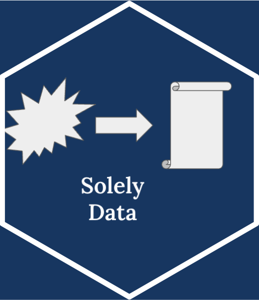

<!-- README.md is generated from README.Rmd. Please edit that file -->

```{r, include = FALSE}
knitr::opts_chunk$set(
  collapse = TRUE,
  comment = "#>",
  fig.path = "man/figures/README-",
  out.width = "100%"
)
```

# SolelyData {width="132"}

<!-- badges: start -->

[](https://github.com/maisha-k/SolelyData/actions/workflows/main.yml)

<!-- badges: end -->

The goal of **SolelyData** is to provide tools for cleaning, organizing, and visualizing datasets efficiently. This package is inspired by the idea of "cleaning the sole" of messy data, ensuring it's ready for analysis.

## Background and Motivation

The **SolelyData** package was developed to address common challenges in data cleaning and preprocessing. Whether you're working with messy datasets from real-world sources or preparing data for advanced analysis, **SolelyData** provides tools to make the process faster, easier, and more reliable.

Key motivations for developing this package:

-   **Time Efficiency**: Minimize manual intervention by automating repetitive data cleaning tasks.

-   **Data Quality**: Ensure your datasets are free from inconsistencies, missing values, and formatting errors.

-   **Versatility**: Designed to handle diverse datasets, including animal shelter data, survey responses, and other real-world records.

This package is especially useful for analysts, researchers, and data scientists who want to focus on extracting insights rather than spending hours cleaning data. This package also generates visually appealing figures and plots that can be shared with collaborators to present the data effectively.

## Installation

You can install the development version of SolelyData like so:

`devtools::install_github("maisha-k/SolelyData")`

## About the Data

The **SolelyData** package includes a built-in dataset sourced from the **King County Animal Shelter** dataset, which is publicly available on [King County's Open Data Portal](https://data.kingcounty.gov/Pets/Lost-found-adoptable-pets/yaai-7frk/about_data). This dataset provides valuable insights into animal shelter operations, including information about lost, found, and adoptable pets in the King County region. The current version of the package uses a version of the dataset that was last updated on December 10, 2024.

#### Why Animal Shelter Data?

The King County Animal Shelter dataset was selected as a built-in example because it exemplifies real-world data challenges, making it an ideal demonstration of SolelyData's capabilities. These challenges include:

-   **Categorical Data**: Fields such as animal type and breed often require standardization to address inconsistencies and correct typos.

-   **Data Validation**: Ensuring intake and outcome dates are accurate and consistent is crucial. The package also identifies issues like non-numeric entries in numeric columns or abnormal values in categorical fields, providing efficient solutions for such anomalies.

-   **Missing Values**: Incomplete records emphasize the need for effective strategies to manage and impute missing data.

This dataset serves as a practical use case to showcase how SolelyData can clean, organize, and prepare data for thorough analysis.

## Functions in the Package

These functions are tailored to address common data cleaning challenges, offering an efficient and user-friendly approach to preparing datasets for analysis. Whether dealing with typos, invalid dates, or missing data, **SolelyData** provides robust tools to handle these tasks seamlessly. Here’s an overview of the core functions available in the package:

-   `solotypo` : Identify single-occurrence values (typos) in a dataset and suggest corrections based on string similarity.
-   `validate_dates` : Validate date columns in your dataset to ensure all entries conform to the correct format and fall within a specified range
-   `flagweirdanimals`: Identify rows with unusual or unexpected categorical values based on a predefined list of valid options.
-   `flagnonnumeric` : Identify non-numeric values in a numeric column and optionally replace them with NA.
-   `missingsum` : Identify columns with missing values and summarize their counts or proportions.
-   `plot_completeness` : Create intuitive visualizations to identify patterns of missing data.

## Examples

You can find these and more code examples for exploring SolelyData in `vignettes("intro-to-solelydata")`.

This is a basic example which shows you how to solve a common problem:

```{r example}
library(SolelyData)

data <- data.frame(
  Fruit = c("apple", "APPLE", "appl", "orange","orange" ,"banana", "BANANA", "banan"),
  stringsAsFactors = FALSE
)

solotypo(data, column = "Fruit")

```

### Getting Help

If you encounter any issues or have questions, check out the following resources:

-   **Documentation**: Detailed function descriptions and examples are available in the package's help files.

-   **Vignettes**: Explore step-by-step guides for specific use cases with `vignettes("intro-to-solelydata")`.

-   **GitHub Repository**: Report bugs or request features at [`https://github.com/maisha-k/SolelyData`](https://github.com/maisha-k/SolelyData).
